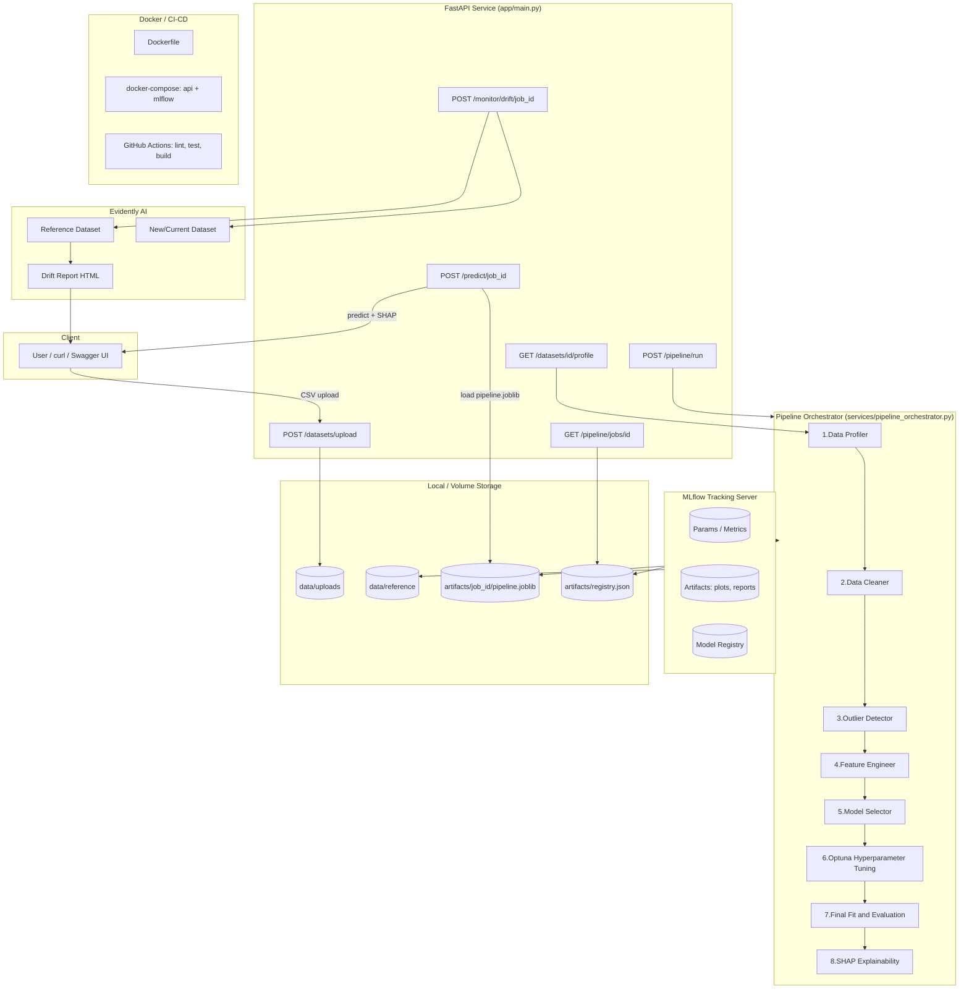

# AutoMLOps Platform — Autonomous ML Engineer

An end-to-end MLOps platform: upload a raw CSV, and it profiles the data,
cleans missing values, handles outliers, engineers features, selects a
model, tunes hyperparameters with **Optuna**, tracks everything in
**MLflow**, explains predictions with **SHAP**, monitors data drift with
**Evidently AI**, and serves the trained model as a prediction API —
all triggered by a single API call.

## Architecture



## Workflow

1. **Upload** — `POST /datasets/upload` stores the CSV under `data/uploads/{dataset_id}.csv`.
2. **Profile** — `GET /datasets/{id}/profile` runs `DataProfiler`: missingness, dtypes,
   cardinality, skew, correlated-feature pairs — read-only, no mutation.
3. **Run the pipeline** — `POST /pipeline/run` with `{dataset_id, target_column}`
   launches a background job that:
   - splits train/holdout,
   - fits `DataCleanerTransformer → OutlierCapTransformer → FeatureEngineerTransformer`
     as real, reusable **scikit-learn transformers** (fit on train only, to avoid leakage),
   - auto-detects classification vs. regression from the target column,
   - baseline cross-validates candidate models (Logistic/Ridge, RandomForest, XGBoost, LightGBM),
   - **tunes the best candidate with Optuna** (TPE sampler, k-fold CV objective),
   - refits the full `sklearn.Pipeline` (preprocessing + tuned model) and evaluates on the untouched holdout,
   - logs params/metrics/artifacts to **MLflow** and persists `pipeline.joblib`,
   - computes a **SHAP** global summary plot (feature importance, in original column names),
   - saves the cleaned training slice as the **Evidently** drift-reference dataset,
   - registers everything in a local JSON model registry keyed by `job_id`.
4. **Poll** — `GET /pipeline/jobs/{job_id}` for status (`pending → running → success/failed`) + metrics.
5. **Predict** — `POST /predict/{job_id}` loads the persisted pipeline and returns
   predictions (+ optional per-row SHAP contributions via `"explain": true`).
6. **Monitor drift** — `POST /monitor/drift/{job_id}` with a new CSV compares it against
   the stored reference set with Evidently's `DataDriftPreset`, returning a summary + an HTML report.
7. **Deploy** — `docker-compose up` runs the API + a real MLflow tracking server together.
   `.github/workflows/ci-cd.yml` lints, tests, and builds the Docker image on every push.

## Project layout

```
automl-platform/
├── app/
│   ├── main.py                     FastAPI app + router wiring
│   ├── api/                        HTTP route handlers (thin controllers)
│   ├── core/                       config loading + logging setup
│   ├── schemas/                    Pydantic request/response models
│   ├── services/                   the actual ML/MLOps logic
│   │   ├── data_profiler.py            Stage 1: profiling
│   │   ├── data_cleaner.py             Stage 2: missing-value cleaning (sklearn transformer)
│   │   ├── outlier_detector.py         Stage 3: outlier capping (sklearn transformer)
│   │   ├── feature_engineer.py         Stage 4: encoding/log-transform/datetime features
│   │   ├── model_selector.py           Stage 5: task detection + baseline model selection
│   │   ├── hyperparameter_tuner.py     Stage 6: Optuna tuning
│   │   ├── experiment_tracker.py       Stage 7: MLflow wrapper
│   │   ├── explainability.py           Stage 8: SHAP
│   │   ├── drift_monitor.py            Stage 9: Evidently AI drift reports
│   │   ├── model_registry.py           local job_id -> model metadata registry
│   │   └── pipeline_orchestrator.py    wires every stage together
│   ├── store/                      simple file-backed async job status store
│   └── utils/                      IO helpers
├── config/config.yaml              all tunable thresholds/defaults in one place
├── tests/                          pytest unit + integration tests
├── sample_data/                    a ready-to-use synthetic churn dataset
├── Dockerfile, docker-compose.yml  containerized API + MLflow server
└── .github/workflows/ci-cd.yml     lint -> test -> build pipeline
```

## Quickstart

### Option A — Docker (recommended)

```bash
docker-compose up --build
```

- API: http://localhost:8000/docs (Swagger UI)
- MLflow UI: http://localhost:5000

### Option B — Local Python

```bash
python -m venv .venv
source .venv/bin/activate        # Windows: .venv\Scripts\activate
pip install -r requirements.txt

uvicorn app.main:app --reload --port 8000
# In another terminal, optionally run a real MLflow server:
mlflow server --backend-store-uri sqlite:///mlflow.db --default-artifact-root ./mlartifacts --port 5000
```

## Example end-to-end session (curl)

```bash
# 1. Upload the bundled sample dataset
curl -F "file=@sample_data/customer_churn_sample.csv" http://localhost:8000/datasets/upload
# -> {"dataset_id": "ds_xxxxxxxxxxxx", "n_rows": 500, ...}

# 2. Inspect the profiling report
curl http://localhost:8000/datasets/ds_xxxxxxxxxxxx/profile

# 3. Kick off the full AutoML pipeline (target = churn)
curl -X POST http://localhost:8000/pipeline/run \
  -H "Content-Type: application/json" \
  -d '{"dataset_id": "ds_xxxxxxxxxxxx", "target_column": "churn", "n_trials": 20}'
# -> {"job_id": "job_yyyyyyyyyyyy", "status": "pending", ...}

# 4. Poll for completion
curl http://localhost:8000/pipeline/jobs/job_yyyyyyyyyyyy

# 5. Predict
curl -X POST http://localhost:8000/predict/job_yyyyyyyyyyyy \
  -H "Content-Type: application/json" \
  -d '{"records": [{"age": 34, "tenure_months": 2, "monthly_charges": 95.5, "total_charges": 191.0, "contract": "month-to-month", "internet_service": "Fiber optic", "signup_date": "2024-01-01", "support_calls": 4}], "explain": true}'

# 6. Check for drift against a new batch of data
curl -F "file=@sample_data/customer_churn_sample.csv" http://localhost:8000/monitor/drift/job_yyyyyyyyyyyy
```

## Why the pipeline stages are built the way they are

- **Leakage-safe preprocessing**: `DataCleanerTransformer`, `OutlierCapTransformer`, and
  `FeatureEngineerTransformer` are real `sklearn.base.TransformerMixin` classes fit *only*
  on the training split, then bundled into one `sklearn.Pipeline` with the final model.
  The whole pipeline is what gets persisted (`pipeline.joblib`) and served — so
  `/predict` replays the *exact* cleaning/encoding logic used at training time,
  with no train/serve skew.
- **Model selection before tuning**: rather than tuning every candidate exhaustively,
  a quick baseline CV pass picks the most promising model family, and Optuna's
  budget is spent tuning that one model properly.
- **SHAP over the whole pipeline**: the explainer wraps the entire fitted pipeline as a
  black-box function, so SHAP values map back to the *original* input columns
  (e.g. `contract`, `age`) instead of internal one-hot-expanded feature names.
- **MLflow + a local registry**: MLflow is the system of record for experiment history
  and model artifacts (browse it at `:5000`); a small `artifacts/registry.json` gives the
  API O(1) lookup from `job_id` to the model file it should serve, without hitting the
  MLflow backend on every prediction request.

## Running tests

```bash
pip install -r requirements.txt
pytest -v
ruff check app tests
```

## Configuration

All thresholds (missing-value drop cutoff, outlier method, skew threshold for
log-transforms, CV folds, Optuna trial budget, drift threshold, etc.) live in
[`config/config.yaml`](config/config.yaml). Most can also be overridden
per-request via the `/pipeline/run` payload (`n_trials`, `test_size`, `task_type`).

## Notes & production hardening ideas

- Background jobs currently run in-process via FastAPI `BackgroundTasks` — for real
  production workloads, swap in Celery/RQ + a broker (Redis) so pipeline runs survive
  API process restarts and can be scaled horizontally.
- Add authentication (API keys / OAuth2) before exposing this publicly.
- Point `MLFLOW_TRACKING_URI` at a Postgres-backed MLflow server + S3/GCS artifact
  store for multi-user, durable experiment tracking.
- Add a scheduled job that periodically calls `/monitor/drift/{job_id}` against fresh
  production data and alerts (Slack/email) when `dataset_drift_detected` is true.
