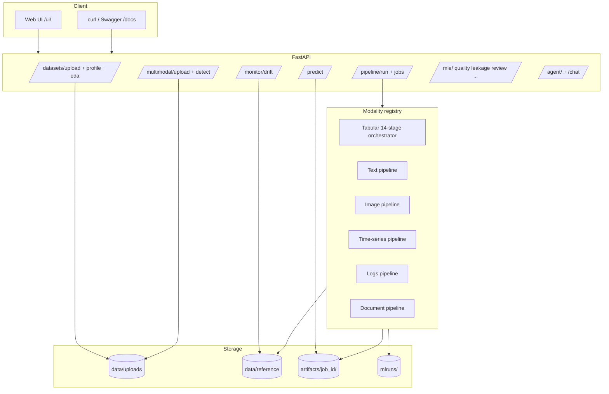

# AutoMLOps Platform — Autonomous ML Engineer

An end-to-end **multi-modal MLOps platform**: upload tabular CSVs, text, images (ZIP), time-series, logs, or documents — the system **auto-detects the data type**, runs the right pipeline, tunes models with **Optuna** (tabular), tracks experiments in **MLflow**, explains predictions (**SHAP** for tabular, keywords/probabilities for text/image), monitors drift with **Evidently AI**, and serves models via a **Web UI** and REST API.

Includes an **ML Suite** (quality, leakage, model review, model cards, experiment compare, active learning), an **AI Advisor** (LangGraph + RAG), and an **ML Chat** assistant.


> **Diagram source:** `docs/workflow_complete.mmd` — regenerate with `py -3.11 scripts/export_mermaid_pngs.py`

---

## Platform workflow (Web UI)

Open **http://localhost:8000/ui/** after starting the server.

| Step | What happens |
|------|----------------|
| **Dashboard** | Models trained, datasets, job history, best metrics |
| **Upload** | CSV, Excel, ZIP (images), text, PDF — modality auto-detected |
| **Profile** | Row/column stats, missing values, modality badge |
| **EDA** | Charts & correlations (tabular only) |
| **Train** | Modality-specific pipeline; leaderboard + metrics on completion |
| **Predict** | JSON single-row or batch CSV; image paths for image models |
| **Drift** | Compare new CSV vs training reference; optional auto-retrain |
| **AI Advisor** | Grounded recommendations from your run (LangGraph + RAG) |
| **ML Chat** | Natural-language ops assistant (Groq/Gemini/Ollama or rules) |
| **ML Suite** | Quality, leakage, model review, insights, compare, model card, active learning |

### Start locally (Windows)

```bat
start.bat
```

Or manually:

```bash
py -3.11 -m uvicorn app.main:app --host 127.0.0.1 --port 8000
```

- **Web UI:** http://localhost:8000/ui/
- **API docs:** http://localhost:8000/docs

Copy `.env.example` → `.env` for optional LLM keys (Advisor/Chat), Tavily, Kaggle.

---

## Supported data types

| Modality | Formats | Pipeline highlights |
|----------|---------|---------------------|
| **Tabular** | CSV, Excel, TSV, SQL | 14-stage AutoML: clean → outliers → features → Optuna → SHAP |
| **Text** | CSV + text column, `.txt`, `.jsonl` | TF-IDF + LightGBM / XGBoost / Logistic / SVM |
| **Image** | ZIP with class folders | RGB resize → PCA → boosting leaderboard (LGBM, XGBoost, RF) |
| **Time-series** | CSV + datetime column | Lag/rolling features → regression models |
| **Logs / tickets** | CSV + message column | TF-IDF + classifier or clustering |
| **Documents** | PDF, TXT | Text extraction → document classifier / RAG index |
| **Database** | SQLAlchemy URL | Export table → auto-detect modality → train |

**Image ZIP layouts supported:**

```
dog/  cat/                    # flat class folders
train/dog/  train/cat/        # nested (train/ is ignored as label)
images/shiba_inu_01.jpg       # breed-style filenames
```

Training caps at **500 images** with **stratified sampling** so all classes are represented.

More detail: [`docs/MULTIMODAL_PLATFORM.md`](docs/MULTIMODAL_PLATFORM.md)  
Sample datasets: [`sample_data/README_TEST_DATA.md`](sample_data/README_TEST_DATA.md)  
Kaggle picks: [`docs/KAGGLE_DATASETS_BY_MODALITY.md`](docs/KAGGLE_DATASETS_BY_MODALITY.md)

---

## Pipelines in detail

### Tabular AutoML (14 stages)

`app/services/pipeline_orchestrator.py` wires:

1. **Data Profiler** — missingness, dtypes, cardinality, skew
2. **Data Cleaner** — imputation, column drops (sklearn transformer)
3. **Outlier Detector** — IQR capping (sklearn transformer)
4. **Feature Engineer** — encoding, log transforms, interactions, binning
5. **Feature Selector** — mutual information / F-test
6. **Leakage Detector** — high target correlation, duplicates
7. **Model Selector** — baseline CV across 10+ algorithms
8. **Optuna Tuning** — TPE hyperparameter search on best candidate
9. **Final Fit & Evaluation** — holdout metrics
10. **SHAP Explainability** — global summary + per-row explanations
11. **MLflow Logging** — params, metrics, artifacts
12. **Model Registry** — local `job_id` → pipeline path
13. **Reference Dataset** — saved for Evidently drift
14. **AI Advisor hook** — optional post-train narrative

Preprocessing transformers are **leakage-safe** (fit on train only) and bundled into one `sklearn.Pipeline` persisted as `pipeline.joblib`.

### Text / image / time-series / logs / documents

Routed via `app/services/modality/registry.py` from `POST /pipeline/run`:

| Modality | Key file | Models |
|----------|----------|--------|
| Text | `text_pipeline.py` | TF-IDF + LightGBM, XGBoost, Logistic, LinearSVC |
| Image | `image_pipeline.py` | PCA + LightGBM, XGBoost, HistGBM, Random Forest, Logistic |
| Time-series | `timeseries_pipeline.py` | Lag features + Ridge, RF, LightGBM, XGBoost |
| Logs | `logs_pipeline.py` | TF-IDF + classifier |
| Documents | `document_pipeline.py` | Text extraction + TF-IDF pipeline |

---

## ML Suite (MLE Intelligence)

Available in the UI **Suite** tab and via `/mle/*` endpoints:

| Feature | Endpoint | Notes |
|---------|----------|-------|
| Dataset quality | `GET /mle/datasets/{id}/quality` | Completeness, balance, dtype issues |
| Leakage check | `GET /mle/datasets/{id}/leakage` | Target leakage, duplicates |
| Model review | `GET /mle/jobs/{id}/review` | AI narrative on model strengths/risks |
| Business insights | `GET /mle/jobs/{id}/business-insights` | Actionable takeaways |
| Model card | `GET /mle/jobs/{id}/model-card` | Export JSON/Markdown |
| Experiment compare | `GET /mle/experiments/compare?job_a=&job_b=` | Side-by-side metrics |
| Counterfactuals | `POST /mle/jobs/{id}/counterfactual` | **Tabular only** — minimal feature change to flip prediction |
| Active learning | `POST /mle/jobs/{id}/active-learning` | Score uncertain rows from CSV |
| Per-feature drift | `POST /mle/monitor/drift/{id}/features` | Upload CSV for column-level drift |

---

## AI Advisor & Chat

| Feature | Endpoint | Description |
|---------|----------|-------------|
| Pre/post-train advisor | `POST /agent/analyze` | LangGraph workflow + RAG knowledge + optional web search |
| Job-specific advisor | `POST /agent/analyze/job/{job_id}` | Recommendations grounded in a completed run |
| ML Chat | `POST /chat/message` | ReAct agent for pipeline ops (needs Groq/OpenAI/Gemini/Ollama or falls back to rules) |
| Chat status | `GET /chat/status` | Which LLM provider is active |

Configure providers in `.env` — see [`.env.example`](.env.example).

---

## Architecture



---

## Project layout

```
automl-platform/
├── app/
│   ├── main.py                     FastAPI entry + UI mount
│   ├── api/                        Route handlers
│   │   ├── routes_dataset.py       Upload, profile, EDA
│   │   ├── routes_multimodal.py    Multi-format upload, DB connect
│   │   ├── routes_pipeline.py      Train jobs, dashboard
│   │   ├── routes_predict.py       Predict, batch, image preview
│   │   ├── routes_monitor.py       Drift monitoring
│   │   ├── routes_mle.py           ML Suite intelligence
│   │   ├── routes_agent.py         AI Advisor
│   │   └── routes_chat.py          ML Chat
│   ├── services/
│   │   ├── pipeline_orchestrator.py    Tabular 14-stage AutoML
│   │   ├── modality/                   Multi-modal pipelines + detector
│   │   ├── drift_monitor.py            Evidently AI
│   │   ├── explainability.py           SHAP
│   │   ├── model_registry.py           job_id lookup
│   │   └── ...                         Quality, leakage, advisor, etc.
│   ├── store/                      Job status (jobs.json — gitignored)
│   └── utils/
├── static/ui/                      Web UI (HTML, CSS, JS)
├── config/config.yaml              Thresholds, modalities, agent settings
├── docs/                           Workflow diagrams, modality guides
├── sample_data/                    Demo CSVs, text, DB, image ZIP
├── tests/                          pytest suite
├── scripts/                        Doc generation, mermaid export
├── start.bat                       Windows one-click start
├── Dockerfile, docker-compose.yml
└── .github/workflows/ci-cd.yml
```

---

## Quickstart

### Option A — Docker

```bash
docker-compose up --build
```

- API + UI: http://localhost:8000/ui/
- MLflow UI: http://localhost:5000

### Option B — Local Python

```bash
python -m venv .venv
# Windows: .venv\Scripts\activate
# Linux/Mac: source .venv/bin/activate
pip install -r requirements.txt
uvicorn app.main:app --host 127.0.0.1 --port 8000
```

Optional MLflow server:

```bash
py -3.11 -m mlflow ui --port 5000
```

---

## Example API sessions

### Tabular (churn)

```bash
# Upload
curl -F "file=@sample_data/customer_churn_sample.csv" http://localhost:8000/datasets/upload

# Train
curl -X POST http://localhost:8000/pipeline/run \
  -H "Content-Type: application/json" \
  -d '{"dataset_id": "ds_xxxxxxxxxxxx", "target_column": "churn", "n_trials": 20}'

# Predict (with SHAP)
curl -X POST http://localhost:8000/predict/job_yyyyyyyyyyyy \
  -H "Content-Type: application/json" \
  -d '{"records": [{"age": 34, "tenure_months": 2, "monthly_charges": 95.5, "total_charges": 191.0, "contract": "month-to-month", "internet_service": "Fiber optic", "signup_date": "2024-01-01", "support_calls": 4}], "explain": true}'

# Drift
curl -F "file=@sample_data/customer_churn_drifted_batch.csv" \
  http://localhost:8000/monitor/drift/job_yyyyyyyyyyyy
```

### Text

```bash
curl -X POST http://localhost:8000/pipeline/run \
  -H "Content-Type: application/json" \
  -d '{"dataset_id": "ds_abc123", "target_column": "sentiment", "text_column": "review_text", "modality": "text"}'
```

### Image (ZIP upload + predict)

```bash
# Upload ZIP via UI or:
curl -F "file=@sample_data/image_samples.zip" http://localhost:8000/multimodal/upload

# Train (modality auto-detected)
curl -X POST http://localhost:8000/pipeline/run \
  -H "Content-Type: application/json" \
  -d '{"dataset_id": "ds_abc123", "target_column": "label"}'

# Predict with local image path (Windows — escape backslashes in JSON)
curl -X POST http://localhost:8000/predict/job_yyyyyyyyyyyy \
  -H "Content-Type: application/json" \
  -d '{"records": [{"image_path": "C:/path/to/train/PNEUMONIA/image.jpeg"}]}'
```

After training an image job, confirm **`label_classes`** lists all classes (e.g. `["normal", "pneumonia"]`) before predicting.

### Database connect

```bash
curl -X POST http://localhost:8000/multimodal/connect-database \
  -H "Content-Type: application/json" \
  -d '{"connection_url": "sqlite:///./sample_data/sample_test.db", "table": "customers", "limit": 50000}'
```

---

## API reference (summary)

| Prefix | Purpose |
|--------|---------|
| `GET /health`, `GET /api` | Health + links |
| `/datasets/*` | Tabular upload, profile, EDA charts |
| `/multimodal/*` | Multi-format upload, modality info, DB connect |
| `/pipeline/*` | Start training, poll jobs, dashboard stats |
| `/predict/*` | Single/batch predict, feature importance, image preview |
| `/monitor/*` | Dataset drift reports |
| `/mle/*` | ML Suite intelligence features |
| `/agent/*` | AI Advisor (LangGraph) |
| `/chat/*` | ML Chat assistant |

Full interactive docs: **http://localhost:8000/docs**

---

## Configuration

All defaults live in [`config/config.yaml`](config/config.yaml):

- Cleaning, outliers, feature engineering thresholds
- Model candidates, CV folds, Optuna trials
- Drift threshold, leakage cutoffs
- Per-modality settings (`modalities.image.max_images`, text TF-IDF size, etc.)
- Agent/RAG relevance weights

Override per request where supported (`n_trials`, `test_size`, `text_column`, `datetime_column`, `modality`).

Environment variables (`.env`): LLM keys, Tavily, Kaggle, `MLFLOW_TRACKING_URI`.

---

## Running tests

```bash
pip install -r requirements.txt
pytest -v
ruff check app tests
```

---

## Design notes

- **Leakage-safe tabular preprocessing** — transformers fit on train only; same pipeline served at predict time.
- **Modality auto-detection** — `app/services/modality/detector.py` inspects columns, file types, and folder structure.
- **Image class balance** — stratified subsampling when capping training images; path-based label extraction for nested folders.
- **MLflow + local registry** — MLflow for experiment history; `artifacts/registry.json` for fast predict lookup.
- **Counterfactuals** — tabular models only (feature-level “what-if” changes).

---

## Production hardening ideas

- Replace in-process `BackgroundTasks` with Celery/RQ + Redis for durable jobs.
- Add API authentication before public exposure.
- Use Postgres-backed MLflow + S3/GCS artifact store.
- Schedule drift checks against production data with alerting.
- For production image/text: optional `torch` / `transformers` for CNN/BERT (platform uses lightweight sklearn baselines by default).

---

## Further reading

| Document | Contents |
|----------|----------|
| [`docs/MULTIMODAL_PLATFORM.md`](docs/MULTIMODAL_PLATFORM.md) | Per-modality preprocessing, models, metrics |
| [`docs/workflow.md`](docs/workflow.md) | Step-by-step workflow summary |
| [`docs/KAGGLE_DATASETS_BY_MODALITY.md`](docs/KAGGLE_DATASETS_BY_MODALITY.md) | Recommended public datasets |
| [`sample_data/README_TEST_DATA.md`](sample_data/README_TEST_DATA.md) | Built-in test files per modality |
