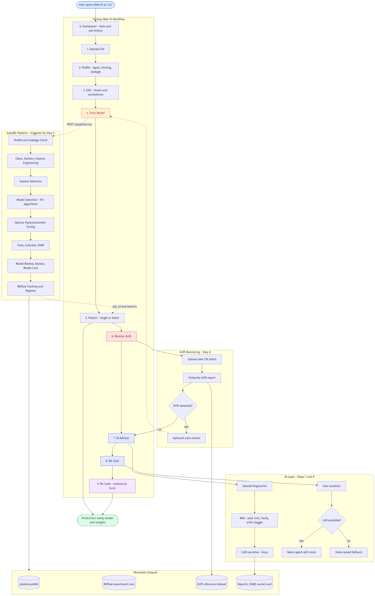

# AutoMLOps Platform — Workflow

End-to-end flow from data upload to model serving, monitoring, and AI assistance.

## Complete workflow

**Source:** `docs/workflow_complete.mmd`  
**Regenerate PNG:** `py -3.11 scripts/export_mermaid_pngs.py`  
**Preview:** Paste `workflow_complete.mmd` into [mermaid.live](https://mermaid.live)

## Step summary

| Step | What happens | Key tech |
|------|----------------|----------|
| **Dashboard** | Workspace overview, job history | FastAPI |
| **Upload** | CSV / multimodal files, auto modality detection | FastAPI |
| **Profile** | Row/column counts, types, missing values | pandas profiling |
| **EDA** | Target distribution, correlations, chart PNGs | matplotlib |
| **Train** | Clean → features → model search → Optuna → best model | sklearn · Optuna · MLflow · SHAP |
| **Predict** | Single-row JSON or batch CSV | saved pipeline |
| **Drift** | Compare new data vs training reference; optional auto-retrain | Evidently |
| **AI Advisor** | Grounded modeling advice from your run | LangGraph · RAG |
| **ML Chat** | Natural-language ops assistant | Groq/Gemini/Ollama or rules |
| **ML Suite** | Quality, leakage, review, insights, compare, model card, active learning | MLE services |
